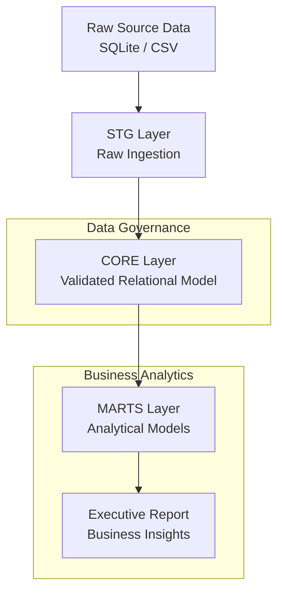

# ChinookAnalytics — Production-Grade SQL Analytical Data Platform

ChinookAnalytics is an end-to-end analytical data platform built entirely in **SQL and PostgreSQL**.

It transforms raw transactional music-store data into validated, structured, and decision-ready analytical assets using a layered architecture, strict integrity enforcement, reconciliation-driven validation, and executive-level reporting.

This is structured analytical engineering — not exploratory SQL.

---

## Architecture Overview



Layered execution:

```
stg → core → profiling → marts → validation
```

Every aggregation reconciles exactly to source revenue totals.

---

## What This Project Delivers

- Layered **stg → core → marts** data architecture  
- Referential integrity & domain constraint enforcement  
- Business-aligned analytical data modeling  
- Revenue reconciliation across all aggregation layers  
- Executive-ready analytical reporting  
- Fully reproducible Dockerized environment  

All marts reconcile **1:1 with core totals** via automated validation.


---

## Business Coverage

The platform materializes analytics across:

- Revenue evolution (MoM / YoY growth)  
- Geographic revenue concentration  
- Customer Lifetime Value (LTV) distribution  
- Revenue dependency risk (Top-N concentration)  
- Artist & genre revenue distribution  
- High-value invoice decomposition  

All metrics are pre-computed, validated, and reproducible.


---

## Validated Metrics Snapshot

* **Total Revenue:** 2328.60
* **Invoices:** 412
* **Customers:** 59
* **Countries:** 24
* **Top-5 Countries:** 58.78% of revenue
* **Top-10 Artists:** 30.98% of revenue
* **Top-10 Customers:** 19.38% of revenue

All aggregations reconcile exactly to the core layer.

---

## Project Structure

```
ChinookAnalytics/
├── data/raw/               # Source SQLite + exported CSV
├── sql/                    # Layered SQL pipeline
│   ├── stg layer
│   ├── core layer
│   ├── marts layer
│   └── validation scripts
├── scripts/                # Automated pipeline execution
├── docker-compose.yml      # Reproducible PostgreSQL environment
└── docs/                   # Data Discovery, Analysis Objectives, Final Report
```

Each SQL layer has a single responsibility, mirroring production data engineering practices.

---

## Technical Stack

- PostgreSQL 16
- Relational Data Modeling (3NF, Keys, Constraints)
- ETL / ELT Pipelines
- Analytical Data Marts Design
- Data Validation & Reconciliation Frameworks
- Referential & Domain Integrity Enforcement
- Revenue Analytics & Customer Analytics
- Docker & Containerized Environments
- Business Intelligence Foundations

---

## Reproducibility

Run the full pipeline locally:

```bash
docker compose up -d
./scripts/02_run_pipeline.sh
```

The pipeline executes deterministically from ingestion to validated analytical outputs.

---

## License

This project is licensed under the MIT License.
See the `LICENSE` file for details.
