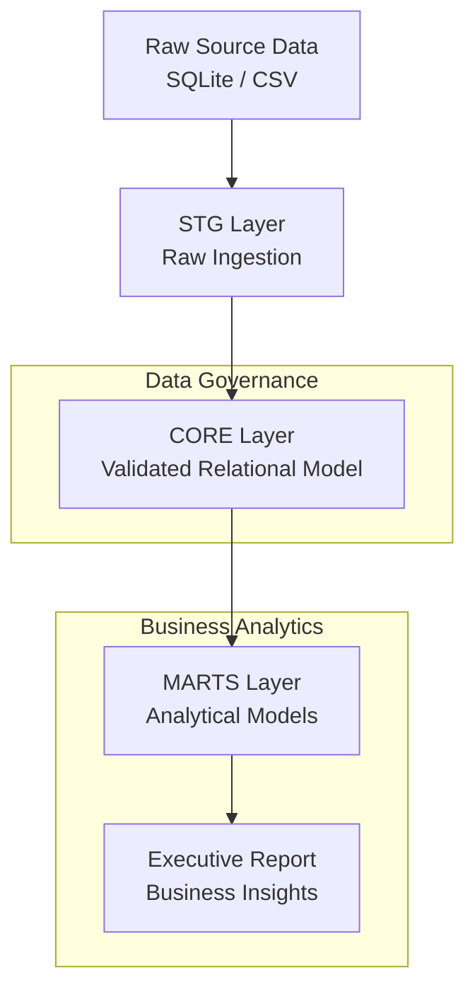

# 🚀 ChinookAnalytics — SQL Analytical Data Platform

ChinookAnalytics is an end-to-end analytical data platform built entirely in SQL and PostgreSQL.

It transforms raw transactional music-store data into validated, structured, and decision-ready analytical assets using a layered architecture, strict integrity enforcement, reconciliation-driven validation, and executive-level reporting.

This is structured analytical engineering — not exploratory SQL.

**Author:** Kevin Mota da Costa

**Portfolio:** [https://costakevinn.github.io](https://costakevinn.github.io)

**LinkedIn:** [https://linkedin.com/in/costakevinnn](https://linkedin.com/in/costakevinnn)

---

## 🎯 Project Purpose

ChinookAnalytics was designed to demonstrate production-style analytical engineering principles:

* Layered data architecture (stg → core → marts)
* Referential and domain integrity enforcement
* Deterministic pipeline execution
* Revenue reconciliation across aggregation layers
* Executive-ready business metrics

The goal is to build analytics that are reliable, financially consistent, and reproducible.

---

## 🏗 Architecture Overview



Layered execution:

```
stg → core → profiling → marts → validation
```

Every aggregation reconciles exactly to source revenue totals.

---

## 🧠 Layer Responsibilities

### STG (Staging)

* Raw ingestion from SQLite / CSV
* Minimal transformation
* Source traceability preserved

### CORE

* Fully validated relational model
* Referential integrity enforcement
* Domain constraints applied
* Clean transactional structure

### MARTS

* Business-aligned analytical models
* Pre-aggregated executive metrics
* Revenue & customer analytics

### Validation

* Revenue reconciliation
* Aggregation consistency checks
* Automated financial verification

All marts reconcile 1:1 with core totals.

---

## 📊 Business Coverage

The platform materializes analytics across:

* Revenue evolution (MoM / YoY growth)
* Geographic revenue concentration
* Customer Lifetime Value (LTV)
* Revenue dependency risk (Top-N concentration)
* Artist & genre revenue distribution
* High-value invoice decomposition

All metrics are pre-computed, validated, and reproducible.

---

## 📈 Validated Metrics Snapshot

* **Total Revenue:** 2328.60
* **Invoices:** 412
* **Customers:** 59
* **Countries:** 24
* **Top-5 Countries:** 58.78% of revenue
* **Top-10 Artists:** 30.98% of revenue
* **Top-10 Customers:** 19.38% of revenue

All aggregations reconcile exactly to the core layer.

---

## 📁 Project Structure

```
ChinookAnalytics/
├── data/raw/               # Source SQLite + exported CSV
├── sql/
│   ├── stg/                # Raw ingestion layer
│   ├── core/               # Validated relational model
│   ├── marts/              # Analytical models
│   └── validation/         # Reconciliation scripts
├── scripts/                # Automated pipeline execution
├── docker-compose.yml      # PostgreSQL environment
└── docs/                   # Data discovery & executive report
```

Each SQL layer has a single responsibility, mirroring production analytics engineering standards.

---

## 🛠 Tech Stack

### Database

PostgreSQL 16

### Data Engineering

* Relational modeling (3NF)
* Keys & constraints
* ETL / ELT pipelines
* Analytical data marts
* Revenue reconciliation frameworks

### Infrastructure

* Docker
* Containerized PostgreSQL
* Deterministic execution

### Analytics

* Revenue analytics
* Customer analytics
* Concentration risk metrics
* Executive reporting

---

## ▶ Reproducibility

Run the full pipeline locally:

```bash
docker compose up -d
./scripts/02_run_pipeline.sh
```

The pipeline executes deterministically from ingestion to validated analytical outputs.

---

## 🌐 Portfolio

This project is part of my Machine Learning & Data Engineering portfolio:
👉 [https://costakevinn.github.io](https://costakevinn.github.io)

---

## License

MIT License — see `LICENSE` for details.
